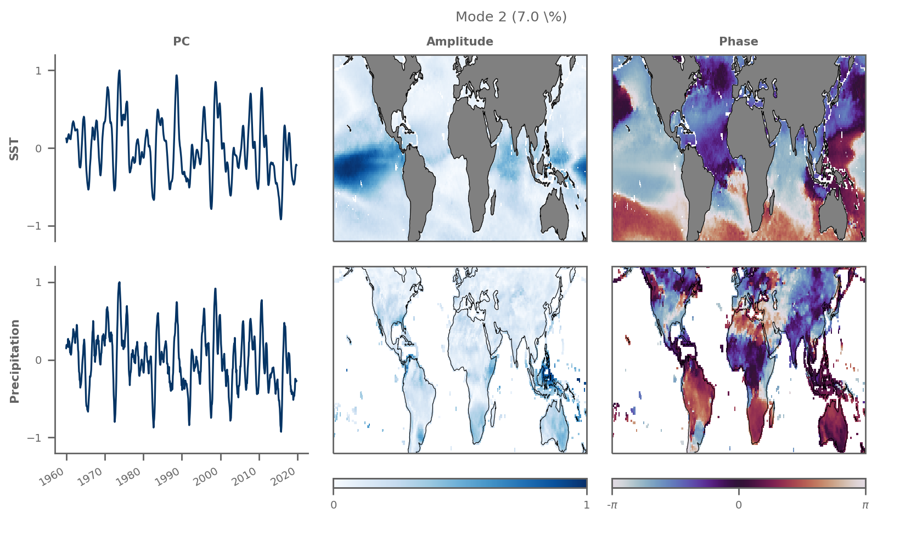
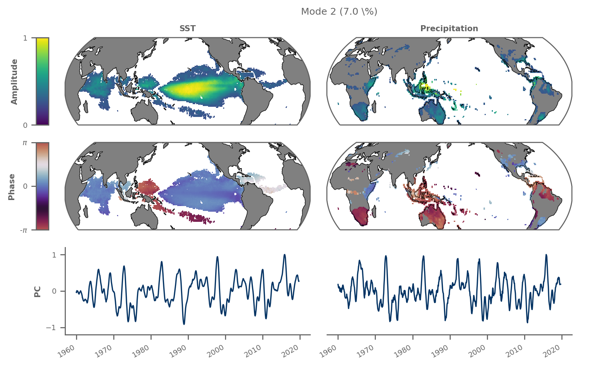

# xMCA | Maximum Covariance Analysis in Python

[](https://pypi.org/project/xmca/)

[](https://pypi.org/project/xmca/)
[](https://github.com/nicrie/xmca/graphs/contributors)

Maximum Covariance Analysis (MCA) maximises the temporal covariance between two different
data fields and is closely related to Principal Component Analysis (PCA) / Empirical
Orthogonal Function (EOF) analysis, which maximises the variance within a single data
field. MCA allows to extract the dominant co-varying patterns between two different data
fields.


The module `xmca` works with `numpy.ndarray` and `xarray.DataArray` as input fields.

## Installation
```
pip install xmca
```
### Dependencies
The file [requirements.txt](requirements.txt) lists all the dependencies. For
automatic installation, you may want to clone and run
```
pip install -r requirements.txt
```

### Known Issues
The dependencies of `cartopy` themselves are not installed via `pip` which is
why the setup will fail if some dependencies are not met. In this case, please
[install][cartopy] `cartopy` first before installing `xmca`.

## Testing
After cloning the repository
```
python -m unittest discover -v -s tests/
```


## Core Features
- Standard PCA/[MCA][mca]
- Rotated PCA/[MCA][rotated-mca]
	- Orthogonal [Varimax][varimax] rotation
	- Oblique [Promax][promax] rotation
- [Complex PCA][complex-pca]/MCA (also known as Hilbert EOF analysis)
	- Optimised [Theta model][theta] extension
- normalization of input data
- latitude correction to compensate for stretched areas in higher latitutes

## Getting started
Import the module for `xarray` via
```py
from xmca.xarray import xMCA
```
Create some dummy data, which should be of type `xr.DataArray`.
```py
import numpy as np
import xarray as xr

t = 300                 # number of time steps
lat1, lon1 = 20, 30     # number of latitudes/longitudes of field A
lat2, lon2 = 15, 10     # number of latitudes/longitudes of field B
A = xr.DataArray(np.random.randn(t,lat1,lon1)) # dummy field A
B = xr.DataArray(np.random.randn(t,lat1,lon2)) # dummy field B
```

### Principal Component Analysis
```py
pca = xMCA(A)                       # PCA on field A
pca.solve(complexfify=False)        # True for complex PCA
#pca.rotate(10)                     # optional; Varimax rotated solution
                                    # using 10 first EOFs
eigenvalues = pca.singular_values() # singular vales = eigenvalues for PCA
pcs         = pca.pcs()             # Principal component scores (PCs)
eofs        = pca.eofs()            # spatial patterns (EOFs)

```

### Maximum Covariance Analysis
```py
mca = xMCA(A,B)                     # MCA of field A and B
mca.solve(complexfify=False)        # True for complex MCA
#mca.rotate(10)                     # optional; Varimax rotated solution
                                    # using 10 first EOFs
eigenvalues = mca.singular_values() # singular vales
pcs = mca.pcs()                     # expansion coefficient (PCs)
eofs = mca.eofs()                   # spatial patterns (EOFs)

```
### Save/load an analysis
```py
mca.save_analysis()                 # this will save the data and a respective
                                    # info file. The files will be stored in a
                                    # special directory
mca2 = xMCA()                       # create a new, empty instance
mca2.load_analysis('./mca/left_right/mca_c0_r00_p00.info') # analysis can be
                                    # loaded via specifying the path to the
                                    # info file created earlier
mca2.plot(mode=1)
```
### Plot your results
The package provides a method to visually inspect the individual modes, e.g. for mode 2.

*Note: The following plots use real data (ERA5 SST & precipitation) instead of the toy data shown at the beginning of the tutorial. Apart from that the figures show exactly what is produced by calling the convenience plotting method.*
```py
mca2.set_field_names('SST', 'Precipitation')  # add variable names, optional
mca2.plot(mode=2)
```


You may want to modify the plot for some better optics:
```py
import cartopy.crs as ccrs  # for different map projections

# map projections for "left" and "right" field
projections = {
    'left': ccrs.EqualEarth(central_longitude=200),
    'right': ccrs.EqualEarth(central_longitude=160)
}

plot_kwargs = {
    "figsize"     : (8, 5),
    "threshold"   : 0.25,       # mask out values < 0.25 max-normalised amplitude
    "orientation" : 'vertical',
    'cmap_eof'    : 'viridis',  # colormap amplitude
    'cmap_phase'  : 'twilight', # colormap phase
    "phase_shift" : 2.2,        # apply phase shift to PCs
    "projection"  : projections,
}
mca2.plot(mode=2, **plot_kwargs)
```



You can save the plot to your local disk as a `.png` file via
```py
save_kwargs={'dpi':200, 'transparent':True}
mca2.save_plot(mode=2, plot_kwargs=plot_kwargs, save_kwargs=save_kwargs)
```

[cartopy]: https://scitools.org.uk/cartopy/docs/latest/installing.html

[mca]: ftp://eos.atmos.washington.edu/pub/breth/papers/1992/SVD-theory.pdf

[rotated-mca]: https://journals.ametsoc.org/jcli/article/8/11/2631/35764/Orthogonal-Rotation-of-Spatial-Patterns-Derived

[varimax]: https://en.wikipedia.org/wiki/Varimax_rotation

[promax]: https://bpspsychub.onlinelibrary.wiley.com/doi/abs/10.1111/j.2044-8317.1964.tb00244.x

[complex-pca]: https://journals.ametsoc.org/doi/abs/10.1175/1520-0450(1984)023%3C1660%3ACPCATA%3E2.0.CO%3B2

[theta]: https://linkinghub.elsevier.com/retrieve/pii/S0169207016300243
