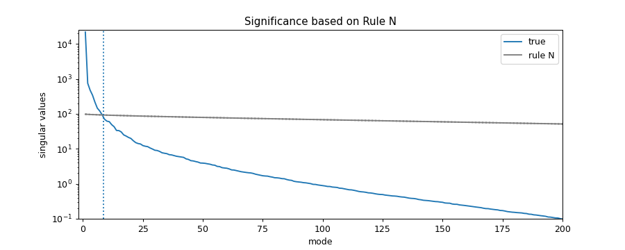
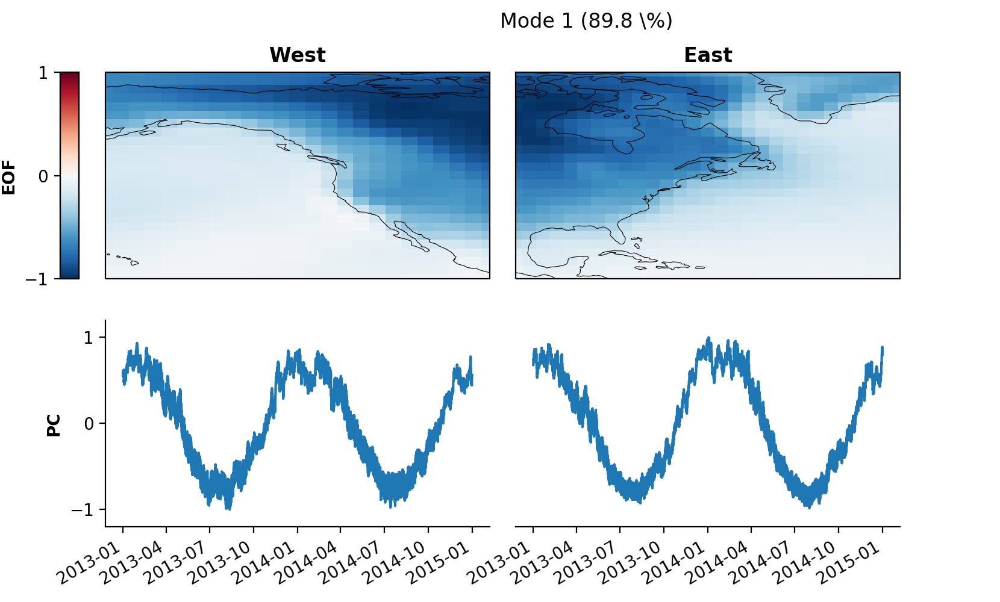
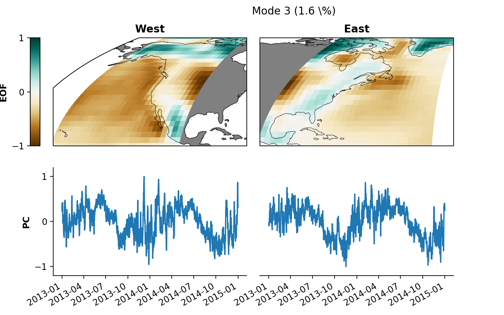

# xMCA | Maximum Covariance Analysis in Python

[](https://pypi.org/project/xmca/)

[](https://pyxmca.readthedocs.io/en/latest/?badge=latest)
[](https://codecov.io/github/nicrie/xmca?branch=master)
[](https://pypi.org/project/xmca/)
[](https://zenodo.org/badge/latestdoi/278134135)

The aim of this package is to provide a flexible tool for the climate science community to perform **Maximum Covariance Analysis (MCA)** in a simple and consistent way. Given the huge popularity of [`xarray`][xarray] in the climate science community, `xmca` supports `xarray.DataArray` as well as `numpy.ndarray` as input formats.


*<sub>Mode 2 of complex rotated Maximum Covariance Analysis showing the shared dynamics of SST and continental precipitation associated to ENSO between 1980 and 2020.</sub>*


## :beginner: What is MCA?
MCA maximises the temporal covariance between two different
data fields and is closely related to Principal Component Analysis (**PCA**) / Empirical
Orthogonal Function analysis (**EOF analysis**). While EOF analysis maximises the variance within a single data
field, MCA allows to extract the dominant co-varying patterns between two different data
fields. When the two input fields are the same, MCA reduces to standard EOF analysis.

For the mathematical understanding please have a look at e.g. [Bretherton et al.][bretherton-paper] or the [lecture material][mca-material] written by C. Bretherton.

## :star: New in release 1.4.x
- Much faster and more memory-efficient algorithm
- Significance testing of individual modes via
  - *Rule N* ([Overland & Preisendorfer 1982][ruleN])
  - Bootstrapping/permutation schemes + block-wise approach for autocorrelated data
  - Iterative permutation ([Winkler et al. 2020][winkler])
- Period parameter of `solve` method provides more flexibility to exponential extension, making complex MCA more stable
- Fixed missing coslat weighting when saving a model ([Issue 25][issue25])

## :pushpin: Core Features


|              	| Standard 	| Rotated 	| Complex 	| Complex Rotated 	|
|--------------	|----------	|----------	|---------	|------------------	|
| EOF analysis 	|[:heavy_check_mark:][pca]|[:heavy_check_mark:][rotated-pca]|[:heavy_check_mark:][complex-pca]|[:heavy_check_mark:][crpca]|
| MCA          	|[:heavy_check_mark:][mca]|[:heavy_check_mark:][rotated-mca]|[:heavy_check_mark:][xmca]|[:heavy_check_mark:][xmca]|

\* *click on check marks for reference* \
\** *Complex rotated MCA is also available as a pre-print on [arXiv][arxiv].*


## :wrench: Installation
Installation is simply done via

    pip install xmca

If you have problems during the installation please consult the documentation or raise an issue here on Github.

## :newspaper: Documentation
A tutorial to get you started as well as the full API can be found in the [documentation](https://pyxmca.readthedocs.io/en/latest/index.html).


## :zap: Quickstart

Import the package

```py
    from xmca.array import MCA  # use with np.ndarray
    from xmca.xarray import xMCA  # use with xr.DataArray
```

As an example, we take North American surface temperatures shipped with
`xarray`. *Note: only works with `xr.DataArray`, not `xr.Dataset`*.


```py
    import xarray as xr  # only needed to obtain test data

    # split data arbitrarily into west and east coast
    data = xr.tutorial.open_dataset('air_temperature').air
    west = data.sel(lon=slice(200, 260))
    east = data.sel(lon=slice(260, 360))
```

#### PCA / EOF analysis
Construct a model with only one field and solve it to perform standard PCA /
EOF analysis.
```py
    pca = xMCA(west)                        # PCA of west coast
    pca.solve(complexify=False)            # True for complex PCA

    svals = pca.singular_values()     # singular vales = eigenvalues for PCA
    expvar      = pca.explained_variance()  # explained variance
    pcs         = pca.pcs()                 # Principal component scores (PCs)
    eofs        = pca.eofs()                # spatial patterns (EOFs)
```

Obtaining a **Varimax/Promax-rotated** solution can be achieved by rotating
the model choosing the number of EOFs to be rotated (`n_rot`) as well as the
Promax parameter (`power`). Here, `power=1` equals a Varimax-rotated solution.
```py
    pca.rotate(n_rot=10, power=1)

    expvar_rot  = pca.explained_variance()  # explained variance
    pcs_rot     = pca.pcs()                 # Principal component scores (PCs)
    eofs_rot    = pca.eofs()                # spatial patterns (EOFs)
```

#### MCA
Same as for PCA / EOF analysis, but with two input fields instead of
one.
```py    
    mca = xMCA(west, east)                  # MCA of field A and B
    mca.solve(complexify=False)            # True for complex MCA

    eigenvalues = mca.singular_values()     # singular vales
    pcs = mca.pcs()                         # expansion coefficient (PCs)
    eofs = mca.eofs()                       # spatial patterns (EOFs)
```

#### Significance analysis
A simple way of estimating the significance of the obtained modes is by
running Monte Carlo simulations based on uncorrelated Gaussian white
noise known as **Rule N** (Overland and Preisendorfer 1982). Here we create 200 of such synthetic data sets and compare the synthetic with the real singular spectrum to assess significance.

```py    
    surr = mca.rule_n(200)
    median = surr.median('run')
    q99 = surr.quantile(.99, dim='run')
    q01 = surr.quantile(.01, dim='run')

    cutoff = np.sum((svals - q99 > 0)).values  # first 8 modes significant

    fig = plt.figure(figsize=(10, 4))
    ax = fig.add_subplot(111)
    svals.plot(ax=ax, yscale='log', label='true')
    median.plot(ax=ax, yscale='log', color='.5', label='rule N')
    q99.plot(ax=ax, yscale='log', color='.5', ls=':')
    q01.plot(ax=ax, yscale='log', color='.5', ls=':')
    ax.axvline(cutoff + 0.5, ls=':')
    ax.set_xlim(-2, 200)
    ax.set_ylim(1e-1, 2.5e4)
    ax.set_title('Significance based on Rule N')
    ax.legend()
```


*The first 8 modes are significant according to rule N using 200 synthetic runs.*


#### Saving/loading an analysis

```py
    mca.save_analysis('my_analysis')    # this will save the data and a respective
                                        # info file. The files will be stored in a
                                        # special directory
    mca2 = xMCA()                       # create a new, empty instance
    mca2.load_analysis('my_analysis/info.xmca') # analysis can be
                                        # loaded via specifying the path to the
                                        # info file created earlier
```

#### Quickly inspect your results visually

The package provides a method to plot individual modes.

```py
    mca2.set_field_names('West', 'East')
    pkwargs = {'orientation' : 'vertical'}
    mca2.plot(mode=1, **pkwargs)
```

*Result of default plot method after performing MCA on T2m of North American west and east coast showing mode 1.*

You may want to modify the plot for some better optics:

```py
    from cartopy.crs import EqualEarth  # for different map projections

    # map projections for "left" and "right" field
    projections = {
        'left': EqualEarth(),
        'right': EqualEarth()
    }

    pkwargs = {
        "figsize"     : (8, 5),
        "orientation" : 'vertical',
        'cmap_eof'    : 'BrBG',  # colormap amplitude
        "projection"  : projections,
    }
    mca2.plot(mode=3, **pkwargs)
```



You can save the plot to your local disk as a ``.png`` file via

```py
    skwargs={'dpi':200}
    mca2.save_plot(mode=3, plot_kwargs=pkwargs, save_kwargs=skwargs)
```


## :bookmark: Please cite
I am just starting my career as a scientist. Feedback on my scientific work is therefore important to me in order to assess which of my work advances the scientific community. As such, if you use the package for your own research and find it helpful, I would appreciate feedback here on [Github](https://github.com/nicrie/xmca/issues/new), via [email](mailto:niclasrieger@gmail.com), or as a [citation](http://doi.org/10.5281/zenodo.4749830):

Niclas Rieger, 2021: nicrie/xmca: version x.y.z. doi:[10.5281/zenodo.4749830](https://doi.org/10.5281/zenodo.4749830).


## :muscle: Credits
Kudos to the developers and contributors of the following Github projects which I initially used myself and used as an inspiration:

* [ajdawson/eofs](https://github.com/ajdawson/eofs)
* [Yefee/xMCA](https://github.com/Yefee/xMCA)

And of course credits to the developers of the extremely useful packages

* [xarray](http://xarray.pydata.org/en/stable/)
* [cartopy](https://scitools.org.uk/cartopy/docs/latest/)


[xarray]: http://xarray.pydata.org/en/stable/

[cartopy]: https://scitools.org.uk/cartopy/docs/latest/installing.html

[pca]: https://en.wikipedia.org/wiki/Empirical_orthogonal_functions

[mca]: ftp://eos.atmos.washington.edu/pub/breth/papers/1992/SVD-theory.pdf

[mca-material]: https://atmos.washington.edu/~breth/classes/AS552/lect/lect22.pdf

[bretherton-paper]: https://journals.ametsoc.org/view/journals/clim/5/6/1520-0442_1992_005_0541_aiomff_2_0_co_2.xml

[rotated-pca]: https://climatedataguide.ucar.edu/climate-data-tools-and-analysis/empirical-orthogonal-function-eof-analysis-and-rotated-eof-analysis

[rotated-mca]: https://journals.ametsoc.org/jcli/article/8/11/2631/35764/Orthogonal-Rotation-of-Spatial-Patterns-Derived

[varimax]: https://en.wikipedia.org/wiki/Varimax_rotation

[promax]: https://bpspsychub.onlinelibrary.wiley.com/doi/abs/10.1111/j.2044-8317.1964.tb00244.x

[complex-pca]: https://journals.ametsoc.org/doi/abs/10.1175/1520-0450(1984)023%3C1660%3ACPCATA%3E2.0.CO%3B2

[crpca]: https://rmets.onlinelibrary.wiley.com/doi/abs/10.1002/joc.3370140706

[theta]: https://linkinghub.elsevier.com/retrieve/pii/S0169207016300243

[xmca]: https://doi.org/10.1175/JCLI-D-21-0244.1

[arxiv]: https://arxiv.org/abs/2105.04618

[winkler]: https://www.sciencedirect.com/science/article/pii/S1053811920305516

[issue25]: https://github.com/nicrie/xmca/issues/25

[ruleN]: https://doi.org/10.1175/1520-0493(1982)110<0001:ASTFPC>2.0.CO;2
